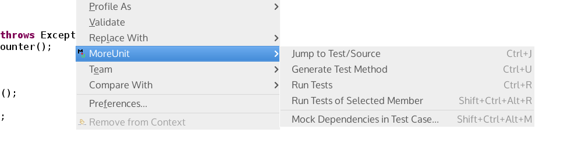

Quizás lo mejor del popular [IDE Eclipse](https://eclipse.org/) es la gran variedad de plugins y extensiones que la comunidad ha creado para ayudar a los desarrolladores en su día a día. Entre ellos os recomiendo **tres que para mí son imprescindibles** y que además me han ayudado a mejorar mis habilidades y buenas prácticas como programador. Ahí van!:

## 1. More Unit

Con un par de clicks [MoreUnit](https://moreunit.github.io/MoreUnit-Eclipse/) te ayuda a escribir rápidamente los tests de **JUnit** o **TestNG** generando el esqueleto de los mismos con el código inicial más habitual (las dependencias inicializadas con **Mockito**, los _before_ y _after_ y un test por cada método de tu clase a probar), listo para sólo tener que escribir la lógica concreta del test. Además te ofrece atajos para saltar rápidamente desde un método hasta su test asociado.

## 2. EclEmma (JaCoCo para Eclipse)

[EclEmma](http://www.eclemma.org/) es un plugin que, además de generarte estadísticas de **cobertura de tests** de tus clases, te genera informes gráficos y te colorea aquellas líneas de código por las cuales no ha pasado ningún test, de forma que encontrarás rápidamente las partes del código que necesites testear más a fondo.

## 3. SonarLint

Si habéis trabajado con [SonarQube](https://www.sonarqube.org/), sabréis lo molesto que es que te falle el _build_ de integración continua por culpa de esa _exception_ que no has enviado al log. [SonarLint](http://www.sonarlint.org/eclipse/) es un plugin que te informa, al mismo tiempo que escribes el código, de la **deuda técnica, malos olores y otras malas prácticas** que puedas estar incurriendo "sin querer" ;). Lo cierto es que, a los pocos minutos de empezar a usarlo, te darás cuenta de que empiezas a escribir código más limpio, ordenado, y menos propenso a los bugs.

Bueno... siento que este post haya quedado un poco más largo, pero espero que me lo perdonéis y os sea útil, realmente estos tres plugins creo que te ayudan y "obligan" a escribir mejor código sin que te des cuenta siquiera. **Enjoy!**
