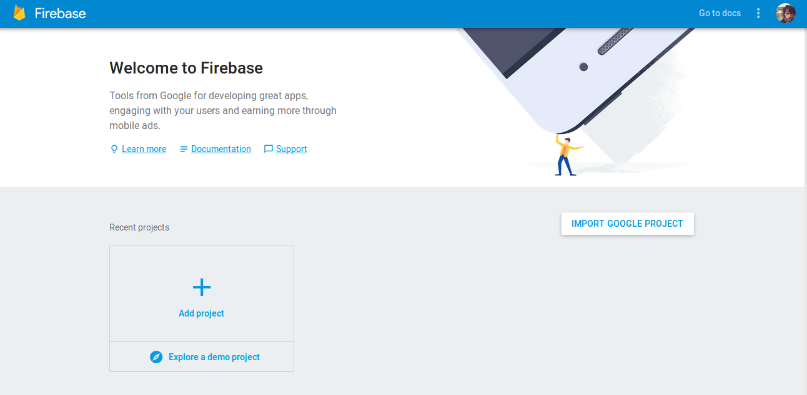
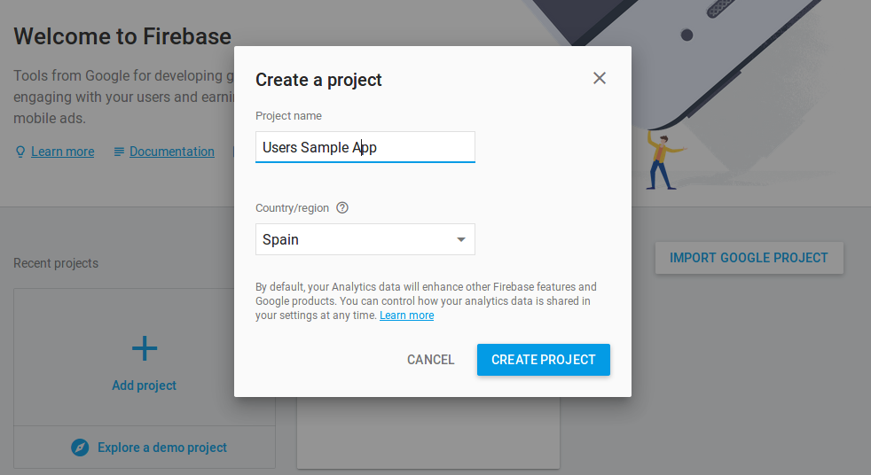
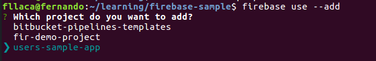
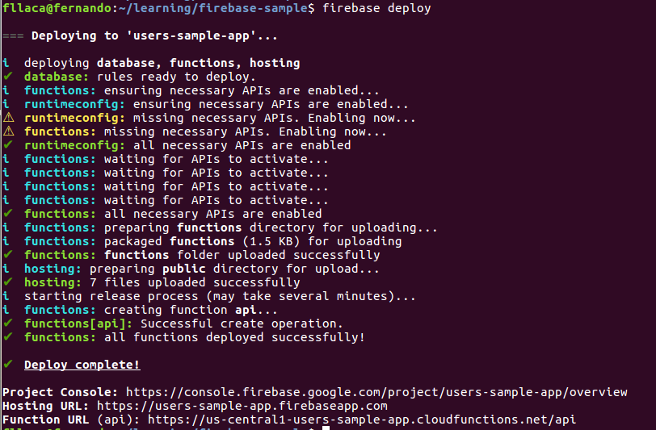
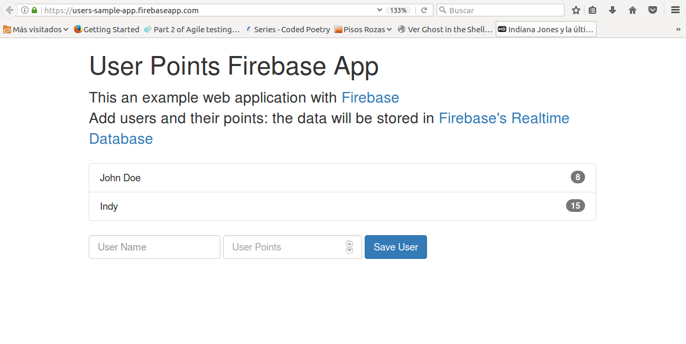

Probablemente ya hayas oído hablar de [Functions as a Service (FaaS)](https://en.wikipedia.org/wiki/Function_as_a_Service), o arquitecturas Server-Less, seguramente con _AWS Lambda_. **Google** no podía ser menos y también ofrece estos servicios, pero además ha dado un paso más con [Firebase](https://firebase.google.com/), un conjunto de servicios totalmente integrados para _hosting_, aplicaciones _server-less_, y almacenamiento de información en base de datos que te permiten desarrollar una aplicación web con muy poco esfuerzo.

En este post veremos como crear un pequeño proyecto de ejemplo de una aplicación web con su propia base de datos y api REST, desplegado todo en Google Cloud... en 5 minutos!

## Requisitos

* [NodeJs + NPM](https://nodejs.org/en/download/package-manager/)
* Firebase Tools: `sudo npm install -g firebase-tools`

## Pasos

### 1. Fork (o clona) el proyecto de ejemplo
He creado un proyecto de ejemplo con una aplicación muy sencilla para registrar puntuaciones de usuarios. Este ejemplo usa las siguietes _features_ de Firebase:
* **Realtime Database**: el servicio de base de datos donde guardaremos la info.
* **Cloud Functions**: el servicio para crear "handlers" de peticiones HTTP, con el que crearemos nuestra API REST
* **Hosting**: con este servicio publicaremos archivos y contenido estático (HTML, CSS..., el "front", vamos)

```bash
git clone https://github.com/fllaca/firebase-sample-app
```

### 2. Crea un proyecto en Firebase Console
Ve a [Firebase Console](https://console.firebase.google.com) y crea un nuevo proyecto, serán un par de clicks!




Curiosea un poco por la consola si quieres, pero no hace falta usarla para el resto del ejemplo.

### 3. Enlaza el código con tu proyecto de Firebase
De vuelta en la terminal, haremos login en Google y "enlazaremos" el fuente con el proyecto que acabamos de crear en la consola web de Firebase:

```bash
# te abrirá en el navegador la ventana de login en Google
firebase login

# te ofrecerá a elegir entre tus proyectos de Firebase
firebase use --add
```

Te pedirá que le des un nombre ("alias") a esa asociación con el proyecto remoto.

### 3. Despliega !!

Y finalmente solo tienes que:
```bash
firebase deploy
```
Y 5... 4... 3... 2... 1... ¡Despegue! Ya tenemos nuestra aplicación web corriendo en los servicios de Google Cloud:




Podéis acceder a la aplicación en la url que os indica al final de la salida de ese comando, en mi caso es [https://users-sample-app.firebaseapp.com/](https://users-sample-app.firebaseapp.com/) (podéis acceder y probar, pero no aseguro que esa URL siga activa indefinidamente).

## Conclusiones
La verdad es que Firebase es un servicio superpotente que ofrece multitud de features y casos de uso donde aplicar, en otro artículo podríamos hacer una review un poco más extensa. Y como habéis visto, **¡es super fácil de usar!** Espero que os haya sido útil el post, no dudéis dejar en los comentarios o en un [tweet](https://twitter.com/nandollaca) vuestro feedback y/o dudas.

**Enjoy!**
